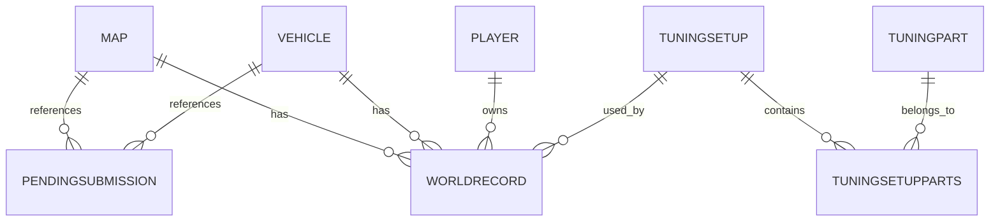

# Database Mapping

Date: 2026-04-20

This document describes the database as used by the current code and as observed in the historical SQLite snapshots.

## Active Database Expected by the Code

The current PHP code expects PostgreSQL:

```php
$dsn = sprintf('pgsql:host=%s;port=%s;dbname=%s', ...);
```

Required variables:

- `DB_HOST`
- `DB_PORT`
- `DB_NAME`
- `DB_USER`
- `DB_PASS`

## Historical Snapshots in the Repository

Files:

- `backups/main-20260326-023356.sqlite`
- `backups/main-20260403-073123.sqlite`

The newest inspected snapshot contains:

| SQLite table | Rows |
| --- | ---: |
| `Map` | 22 |
| `Vehicle` | 34 |
| `Player` | 247 |
| `TuningPart` | 19 |
| `TuningSetup` | 172 |
| `TuningSetupParts` | 650 |
| `WorldRecord` | 753 |
| `PendingSubmission` | 241 |
| `News` | 32 |

## PostgreSQL vs SQLite Naming Difference

The current PHP code queries prefixed PostgreSQL-style table names:

- `_map`
- `_vehicle`
- `_player`
- `_tuningpart`
- `_tuningsetup`
- `_tuningsetupparts`
- `_worldrecord`

The SQLite snapshots use non-prefixed names:

- `Map`
- `Vehicle`
- `Player`
- `TuningPart`
- `TuningSetup`
- `TuningSetupParts`
- `WorldRecord`

The snapshots are useful for understanding the model, but the FastAPI migration must follow the PostgreSQL schema used by the current PHP runtime unless the production schema proves otherwise.

## Core Tables

### Map / `_map`

Observed SQLite columns:

| Column | Type | Notes |
| --- | --- | --- |
| `idMap` | INT | Primary key |
| `nameMap` | TEXT | Required, unique |
| `special` | TINYINT | Required, 0 or 1 |

The PHP code currently uses `idMap` and `nameMap`.

### Vehicle / `_vehicle`

| Column | Type | Notes |
| --- | --- | --- |
| `idVehicle` | INT | Primary key |
| `nameVehicle` | TEXT | Required, unique |

### Player / `_player`

| Column | Type | Notes |
| --- | --- | --- |
| `idPlayer` | INT | Primary key |
| `namePlayer` | TEXT | Required |
| `country` | TEXT | Nullable |

Important: the snapshot includes a player with id `0`. Do not filter or normalize it unless that is explicitly required later.

### TuningPart / `_tuningpart`

| Column | Type | Notes |
| --- | --- | --- |
| `idTuningPart` | INTEGER | Primary key |
| `nameTuningPart` | TEXT | Required, unique |

### TuningSetup / `_tuningsetup`

| Column | Type | Notes |
| --- | --- | --- |
| `idTuningSetup` | INTEGER | Primary key |

### TuningSetupParts / `_tuningsetupparts`

| Column | Type | Notes |
| --- | --- | --- |
| `idTuningSetup` | INTEGER | Part of primary key |
| `idTuningPart` | INTEGER | Part of primary key |

### WorldRecord / `_worldrecord`

Observed SQLite columns:

| Column | Type | Notes |
| --- | --- | --- |
| `idMap` | INT | Map reference |
| `idVehicle` | INT | Vehicle reference |
| `idPlayer` | INT | Player reference |
| `distance` | INT | Required, must be positive |
| `current` | TINYINT | Required, 0 or 1 |
| `idTuningSetup` | INTEGER | Nullable setup reference |
| `questionable` | TINYINT | Required, default 0 |

Fields expected by the current PHP PostgreSQL queries:

- `idRecord`
- `idMap`
- `idVehicle`
- `idPlayer`
- `distance`
- `current`
- `idTuningSetup`
- `questionable`
- `questionable_reason`

Important difference: `idRecord` and `questionable_reason` were not present in the inspected SQLite snapshots, but they are used by current PHP code.

### PendingSubmission

| Column | Type | Notes |
| --- | --- | --- |
| `id` | INTEGER | Primary key |
| `idMap` | INTEGER | Nullable |
| `idVehicle` | INTEGER | Nullable |
| `distance` | INTEGER | Nullable |
| `playerName` | TEXT | Nullable |
| `playerCountry` | TEXT | Nullable |
| `submitterIp` | TEXT | Nullable |
| `status` | TEXT | Defaults to `pending` |
| `submitted_at` | DATETIME | Defaults to current timestamp |
| `tuningParts` | TEXT | Nullable |

### News

| Column | Type | Notes |
| --- | --- | --- |
| `id` | INTEGER | Primary key |
| `title` | TEXT | Required |
| `content` | TEXT | Required |
| `author` | TEXT | Nullable |
| `created_at` | DATETIME | Defaults to current timestamp |

## Relationships



## Critical Query Contracts

### Public Records

Required output fields:

- `idRecord`
- `distance`
- `current`
- `idTuningSetup`
- `questionable`
- `questionable_reason`
- `map_name`
- `vehicle_name`
- `player_name`
- `player_country`
- `tuning_parts`

Required behavior:

- Join records with map, vehicle and player.
- Left join tuning setup parts.
- Filter `wr.current = 1`.
- Aggregate tuning part names as a comma-separated string.

### Tuning Setups

Required output shape:

```json
[
  {
    "idTuningSetup": 1,
    "parts": [
      { "nameTuningPart": "Wings" }
    ]
  }
]
```

### Public Submission Rate Limit

Current PostgreSQL logic:

```sql
SELECT COUNT(1) AS c
FROM PendingSubmission
WHERE submitterIp = :ip
  AND submitted_at >= NOW() - INTERVAL '1 hour'
```

### Manual Id Generation

Map and vehicle creation currently use `MAX(id) + 1`.

Do not replace this with sequences until the production schema is verified.

## Sample Snapshot Data

Map examples:

- `1`, `Countryside`
- `2`, `Forest`
- `3`, `City`

Vehicle examples:

- `1`, `Hill Climber`
- `2`, `Scooter`
- `3`, `Bus`

Tuning part examples:

- `1`, `Wings`
- `2`, `Magnet`
- `3`, `Landing Boost`

World record example:

- `idMap=1`, `idVehicle=13`, `idPlayer=6`, `distance=20413`, `current=1`, `idTuningSetup=20`, `questionable=0`

## Database Migration Rules

1. Do not change the schema in the initial migration.
2. Build FastAPI against the existing PostgreSQL schema.
3. Keep SQL in repositories instead of route handlers.
4. Add contract tests for JSON output.
5. Document production schema differences before changing queries.
6. Treat SQLite snapshots as historical references, not as the active runtime source.

## Items to Clarify Before Destructive Changes

- Exact production PostgreSQL schema.
- Type and constraints of `idRecord`.
- Type and constraints of `questionable_reason`.
- Production indexes.
- Official PostgreSQL backup strategy.
- Whether SQLite snapshots should remain archived or be removed later.
