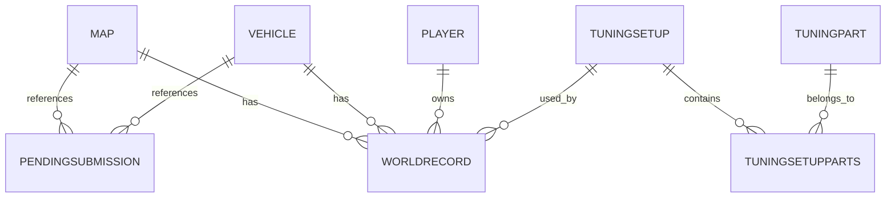

# Mapping BDD existant

Date: 2026-04-20

Ce document decrit la base de donnees telle que le code actuel l'utilise et telle que les snapshots SQLite historiques la montrent.

## Moteur actif attendu

Le code actuel utilise PostgreSQL:

```php
$dsn = sprintf('pgsql:host=%s;port=%s;dbname=%s', ...);
```

Variables:

- `DB_HOST`
- `DB_PORT`
- `DB_NAME`
- `DB_USER`
- `DB_PASS`

## Snapshots presents dans le repo

Fichiers:

- `backups/main-20260326-023356.sqlite`
- `backups/main-20260403-073123.sqlite`

Le plus recent inspecte:

- `main-20260403-073123.sqlite`

Comptages:

| Table SQLite | Rows |
| --- | ---: |
| `Map` | 22 |
| `Vehicle` | 34 |
| `Player` | 247 |
| `TuningPart` | 19 |
| `TuningSetup` | 172 |
| `TuningSetupParts` | 650 |
| `WorldRecord` | 753 |
| `PendingSubmission` | 241 |
| `News` | 32 |

## Ecart SQLite historique vs PostgreSQL actuel

Le code PHP actuel requete des tables prefixees:

- `_map`
- `_vehicle`
- `_player`
- `_tuningpart`
- `_tuningsetup`
- `_tuningsetupparts`
- `_worldrecord`

Les snapshots SQLite contiennent des noms non prefixees:

- `Map`
- `Vehicle`
- `Player`
- `TuningPart`
- `TuningSetup`
- `TuningSetupParts`
- `WorldRecord`

Conclusion:

- Les snapshots sont utiles pour comprendre le modele, mais ne sont pas forcement le schema exact de production.
- La migration FastAPI doit se brancher sur PostgreSQL et respecter les noms actuellement requetes par PHP, sauf schema de production contraire fourni plus tard.

## Tables metier

### Map / `_map`

Colonnes observees SQLite:

| Colonne | Type | Contraintes |
| --- | --- | --- |
| `idMap` | INT | PK |
| `nameMap` | TEXT | NOT NULL, UNIQUE |
| `special` | TINYINT | NOT NULL, check 0/1 |

Utilisation PHP:

- `idMap`
- `nameMap`

Le champ `special` n'est pas utilise par le PHP actuel pour les stats; les maps speciales sont codees en dur cote front:

- `Forest Trials`
- `Intense City`
- `Raging Winter`

### Vehicle / `_vehicle`

Colonnes observees:

| Colonne | Type | Contraintes |
| --- | --- | --- |
| `idVehicle` | INT | PK |
| `nameVehicle` | TEXT | NOT NULL, UNIQUE |

### Player / `_player`

Colonnes observees:

| Colonne | Type | Contraintes |
| --- | --- | --- |
| `idPlayer` | INT | PK |
| `namePlayer` | TEXT | NOT NULL |
| `country` | TEXT | nullable |

Note:

- Le snapshot contient un player `idPlayer=0`, `namePlayer=___`, `country=___`.
- Ne pas filtrer arbitrairement ces valeurs pendant migration.

### TuningPart / `_tuningpart`

Colonnes observees:

| Colonne | Type | Contraintes |
| --- | --- | --- |
| `idTuningPart` | INTEGER | PK |
| `nameTuningPart` | TEXT | NOT NULL, UNIQUE |

### TuningSetup / `_tuningsetup`

Colonnes observees:

| Colonne | Type | Contraintes |
| --- | --- | --- |
| `idTuningSetup` | INTEGER | PK |

### TuningSetupParts / `_tuningsetupparts`

Colonnes observees:

| Colonne | Type | Contraintes |
| --- | --- | --- |
| `idTuningSetup` | INTEGER | PK part, FK setup |
| `idTuningPart` | INTEGER | PK part, FK part |

### WorldRecord / `_worldrecord`

Colonnes observees SQLite:

| Colonne | Type | Contraintes |
| --- | --- | --- |
| `idMap` | INT | PK part, FK map |
| `idVehicle` | INT | PK part, FK vehicle |
| `idPlayer` | INT | NOT NULL, FK player |
| `distance` | INT | NOT NULL, check > 0 |
| `current` | TINYINT | PK part, check 0/1 |
| `idTuningSetup` | INTEGER | nullable, FK setup |
| `questionable` | TINYINT | NOT NULL default 0 |

Colonnes attendues par PHP PostgreSQL:

- `idRecord`
- `idMap`
- `idVehicle`
- `idPlayer`
- `distance`
- `current`
- `idTuningSetup`
- `questionable`
- `questionable_reason`

Ecart important:

- `idRecord` et `questionable_reason` ne sont pas presents dans les snapshots SQLite inspectes, mais sont utilises par le PHP actuel.

### PendingSubmission

Colonnes observees:

| Colonne | Type | Contraintes |
| --- | --- | --- |
| `id` | INTEGER | PK autoincrement |
| `idMap` | INTEGER | nullable |
| `idVehicle` | INTEGER | nullable |
| `distance` | INTEGER | nullable |
| `playerName` | TEXT | nullable |
| `playerCountry` | TEXT | nullable |
| `submitterIp` | TEXT | nullable |
| `status` | TEXT | default `pending` |
| `submitted_at` | DATETIME | default CURRENT_TIMESTAMP |
| `tuningParts` | TEXT | nullable |

Utilisation:

- Soumissions publiques.
- Admin approve/reject.
- Rate limit par `submitterIp` et `submitted_at`.

### News

Colonnes observees:

| Colonne | Type | Contraintes |
| --- | --- | --- |
| `id` | INTEGER | PK autoincrement |
| `title` | TEXT | NOT NULL |
| `content` | TEXT | NOT NULL |
| `author` | TEXT | nullable |
| `created_at` | DATETIME | default CURRENT_TIMESTAMP |

## Relations



## Requetes critiques actuelles

### Records publics

Retour attendu:

- `idRecord`
- `distance`
- `current`
- `idTuningSetup`
- `questionable`
- `questionable_reason`
- `map_name`
- `vehicle_name`
- `player_name`
- `player_country`
- `tuning_parts`

Jointures:

- `_worldrecord` -> `_map`
- `_worldrecord` -> `_vehicle`
- `_worldrecord` -> `_player`
- `_worldrecord` -> `_tuningsetupparts`
- `_tuningsetupparts` -> `_tuningpart`

Filtre:

- `wr.current = 1`

Aggregation:

- `string_agg(tp.nameTuningPart, ', ')`

### Tuning setups

Retour:

```json
[
  {
    "idTuningSetup": 1,
    "parts": [
      { "nameTuningPart": "Wings" }
    ]
  }
]
```

### Public submit rate limit

PostgreSQL:

```sql
SELECT COUNT(1) AS c
FROM PendingSubmission
WHERE submitterIp = :ip
  AND submitted_at >= NOW() - INTERVAL '1 hour'
```

### Add map/vehicle

IDs generes manuellement:

```sql
SELECT COALESCE(MAX(idMap), 0) AS m FROM _map
SELECT COALESCE(MAX(idVehicle), 0) AS m FROM _vehicle
```

Ne pas remplacer par sequence sans verifier la BDD de production.

## Donnees d'exemple du snapshot

Map:

- `1`, `Countryside`
- `2`, `Forest`
- `3`, `City`

Vehicle:

- `1`, `Hill Climber`
- `2`, `Scooter`
- `3`, `Bus`

TuningPart:

- `1`, `Wings`
- `2`, `Magnet`
- `3`, `Landing Boost`

WorldRecord:

- `idMap=1`, `idVehicle=13`, `idPlayer=6`, `distance=20413`, `current=1`, `idTuningSetup=20`, `questionable=0`

## Decisions prudentes pour la migration BDD

1. Ne pas modifier le schema au debut.
2. Commencer FastAPI sur PostgreSQL avec les tables existantes.
3. Creer des repositories SQL explicites correspondant aux requetes PHP.
4. Ajouter tests de contrat sur les shapes JSON.
5. Documenter tout ecart production/snapshot avant action.
6. Reporter toute normalisation schema a une phase separee.

## Points a clarifier avant toute migration destructive

- Schema PostgreSQL exact en production.
- Presence et type de `idRecord`.
- Presence et type de `questionable_reason`.
- Contraintes et indexes de production.
- Strategie officielle de backup PostgreSQL.
- Si les backups SQLite doivent rester supportes ou seulement archives.
